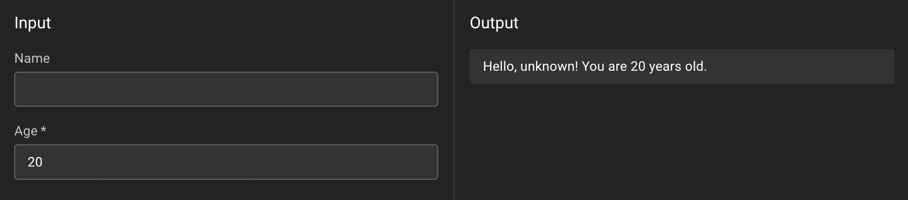

# Create an App

An app is just a TypeScript function.
Moyuk automatically generates a form from the default export function's signature.

## How to create an app

1. Click on **+** Button on the navigation bar or **New App** button on the dashboard.
1. Edit the TypeScript code in the editor. Make sure to export a function as `default`.
1. Name the app in **App Info** tab.
1. (Optional) Customize the form in **Form Customization** tab.
1. Click on **Publish changes** button to release the app.

## Edit the code

You can edit the code in the editor in the **Code** tab.
The editor is powered by [Monaco Editor](https://microsoft.github.io/monaco-editor/), which is the same editor used in Visual Studio Code.

:::note

Moyuk currently doesn't support multiple files.

:::

### Code to create a form

Moyuk finds the default export function and generates a form from its signature.

- The parameters of the function are used as the form's input fields.
  - The parameter's type is used to determine the input field's type.
	- The parameter's default value is used as the input field's default value.
	- The parameter's name is used as the input field's label. (Converted to title case)
- The return value of the function is used as the form's output.
- The compiled function handles the form's submission.
  - By default, the function is called when the input values are changed.
	- You can change this behavior in **Form Customization** tab.


#### Example

```ts
export default function run(
	name: string, // This becomes a text input field.
	age: number = 20, // This becomes a number input field with the default value of 20.
) {
	return `Hello, ${name || 'unknown'}! You are ${age} years old.`; // This becomes a readonly text field.
}
```

This code generates a form like this:


